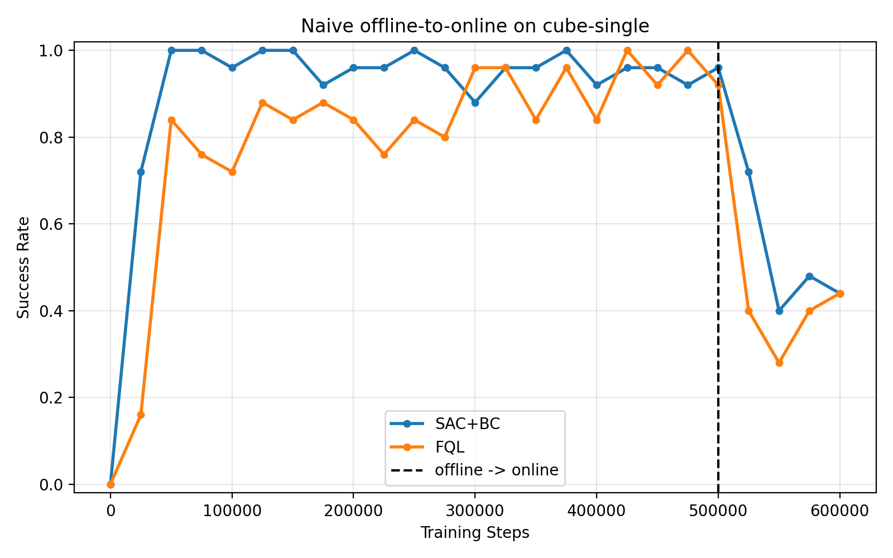
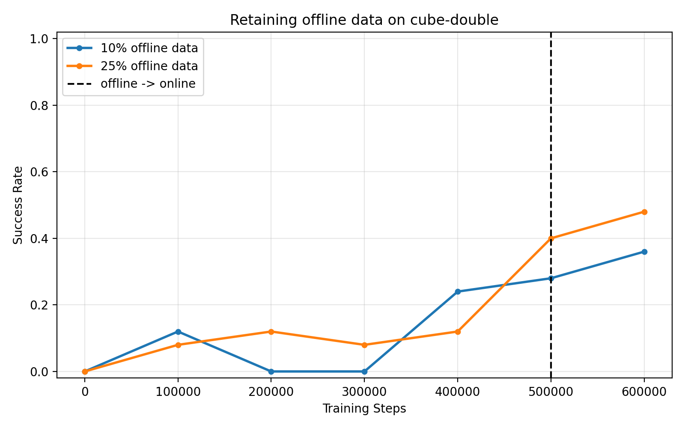
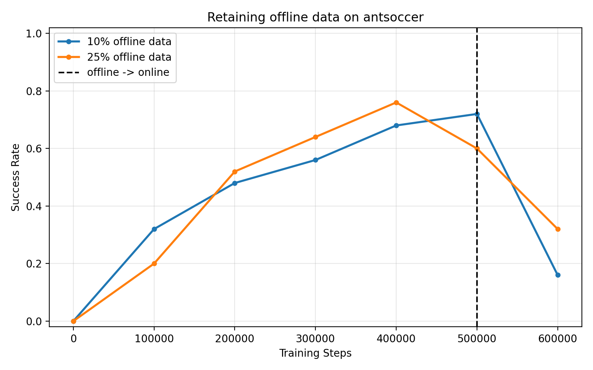
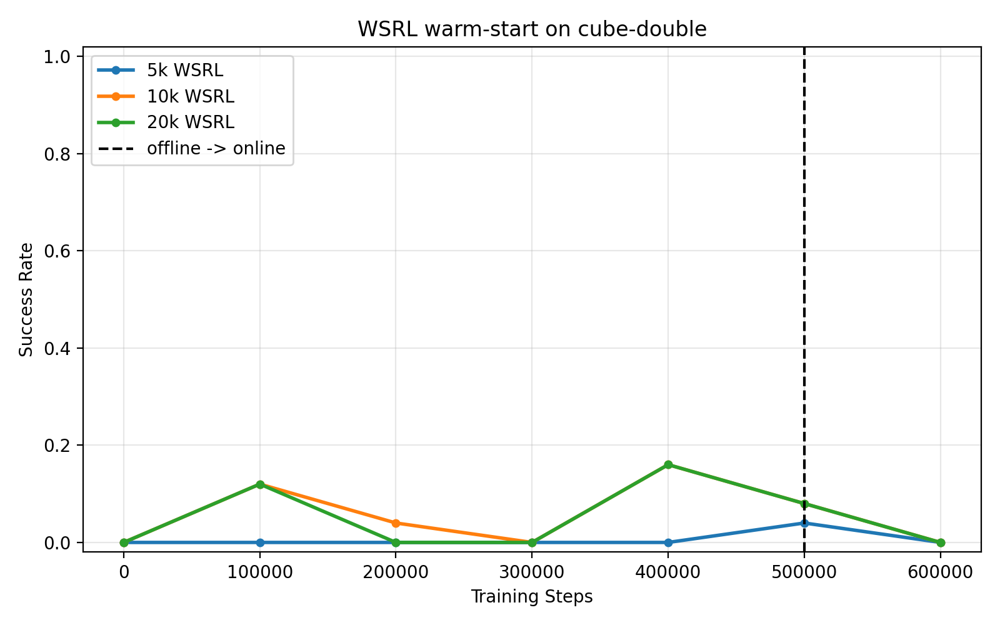
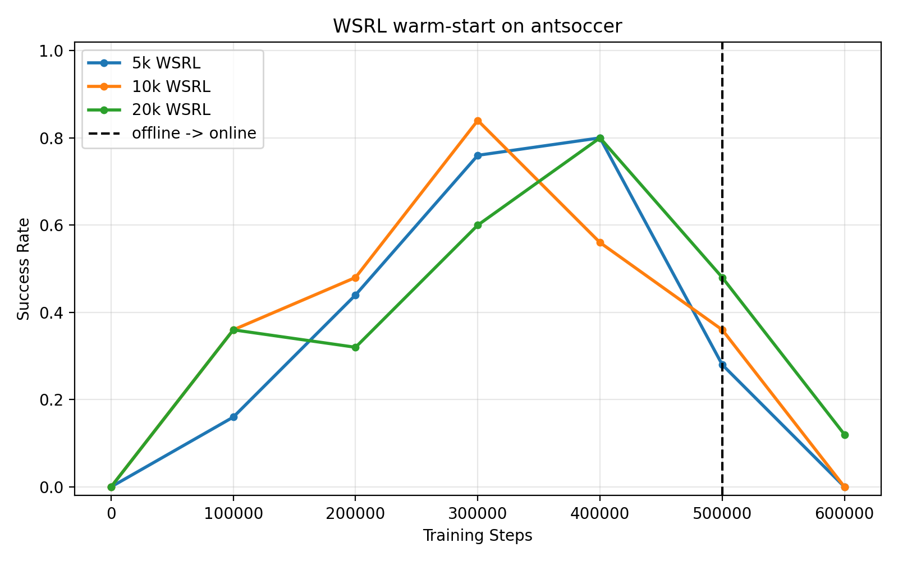
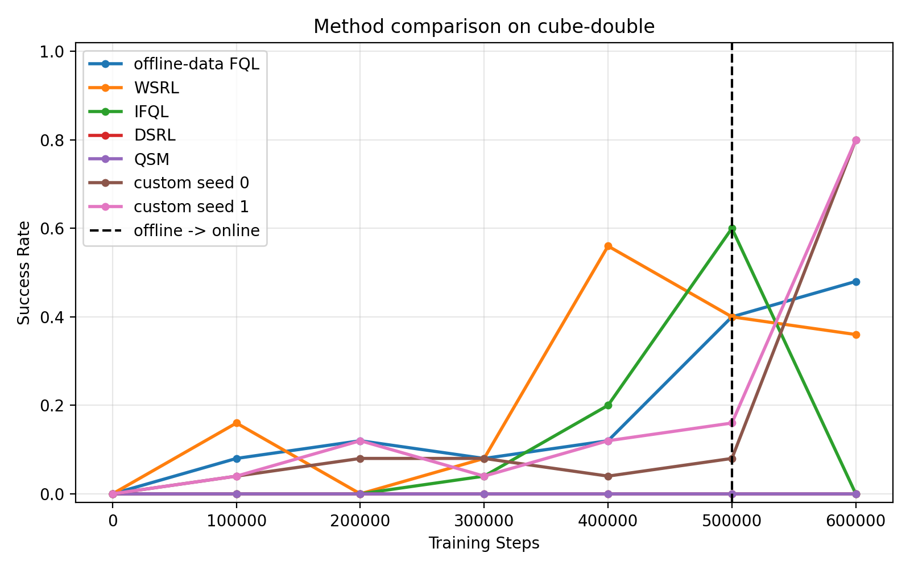
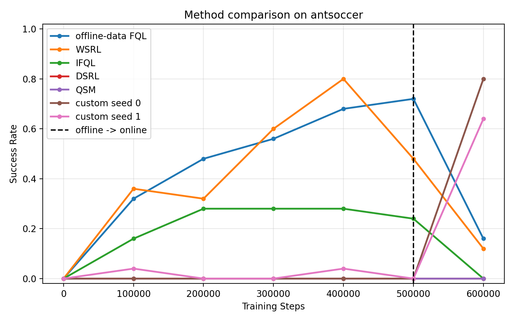

# Offline-to-Online Reinforcement Learning with Critic-Ranked Flow Actions

Sreeram Ranga  
CS 185/285 Final Project  
Spring 2026

## Abstract

I studied offline-to-online reinforcement learning on the OGBench cube and antsoccer tasks. The main issue I saw is that a policy can look good at the end of offline training, but then become worse after online fine-tuning because the replay data changes. I first tested the required baselines: SAC+BC, FQL, retaining offline data, WSRL, IFQL, DSRL, and QSM. Then I implemented my own method by extending FQL with critic-ranked action sampling and a frozen actor during online fine-tuning. My method keeps the expressive flow policy from FQL, but it chooses the best action from several sampled actions using the critic. This gave much better online performance than the baselines in my completed runs. On cube-double, my method reached 80% success on both seeds. On antsoccer, it reached 80% on seed 0 and 64% on seed 1.

## Introduction

Offline-to-online RL is useful because it starts from a fixed dataset and then improves by collecting new data from the environment. This should be better than starting online RL from scratch, but it also creates a hard distribution shift. During offline training, the agent only sees the dataset distribution. During online fine-tuning, the replay buffer starts to contain actions from the learned policy, and those actions can be worse or different from the original dataset actions.

In this project, I tested several ways to reduce this problem. The simple baselines often had strong offline performance but lost success rate during online training. This suggested that the policy was drifting too much after the online phase started. My final method tries to keep the good parts of FQL while making action selection more conservative. Instead of using one sampled action, I sample multiple candidate actions and choose the one with the highest critic value. During online fine-tuning, I update the critic but freeze the actors, so the policy does not move too far away from the offline behavior.

## Related Work

SAC+BC adds a behavior cloning penalty to a SAC-style objective. This makes the policy care about high Q-values while still staying close to the data. In my runs, SAC+BC worked well offline on cube-single, but it still dropped after online fine-tuning.

FQL uses a flow-matching behavior policy and a one-step policy. The flow policy learns the data distribution, and the one-step policy is trained with a mix of Q maximization and distillation from the flow policy. This is more expressive than a simple Gaussian policy, but it can still become unstable online if the actor updates too much from a small or shifted replay buffer.

Retaining offline data keeps some offline transitions in the online replay buffer. The point is to reduce the distribution shift between the offline and online phases. WSRL takes a different approach: it lets the offline policy collect warm-up data first, stores that data, and only starts updates after the warm-up period. Both methods try to make the online replay buffer less noisy.

IFQL adapts IQL-style value learning to a flow policy, then uses rejection sampling at test time. DSRL does RL in the latent noise space of a flow or diffusion policy. QSM changes the diffusion policy objective by aligning policy score updates with Q gradients. These methods all try to improve policy extraction or action generation, but my runs showed that they were sensitive to implementation details and hyperparameters.

## Method

My method is based on FQL. I keep the same BC flow actor, one-step actor, critic ensemble, and FQL losses during offline training. The change is in how actions are selected and how online training is handled.

At action selection time, I sample multiple actions from the one-step policy. In my final runs, I used 64 candidate actions. I evaluate each candidate using the critic ensemble and use the minimum Q-value across the ensemble as a conservative score. Then I choose the action with the highest score. This is similar in spirit to rejection sampling, but I apply it to the FQL one-step policy.

For critic bootstrapping, I also use best-of-N action selection for the next action, but with fewer samples. I used 8 target samples in my final runs. This keeps the target update cheaper while still making it less dependent on one random action sample.

During the online phase, I freeze both actors and only update the critic. I made this choice because the naive FQL and SAC+BC curves showed a large drop after online training began. My interpretation is that actor updates on early online data can move the policy away from the better offline policy too quickly. By freezing the actor, the online phase instead improves the critic used for ranking candidate actions. This lets the method use new online information without changing the whole action distribution.

The final hyperparameters I used were:

<table>
  <thead>
    <tr>
      <th>Environment</th>
      <th>alpha</th>
      <th>offline data retained</th>
      <th>action samples</th>
      <th>target samples</th>
    </tr>
  </thead>
  <tbody>
    <tr>
      <td>cube-double</td>
      <td>100</td>
      <td>25%</td>
      <td>64</td>
      <td>8</td>
    </tr>
    <tr>
      <td>antsoccer</td>
      <td>30</td>
      <td>25%</td>
      <td>64</td>
      <td>8</td>
    </tr>
  </tbody>
</table>

## Experimental Results

All experiments used 500,000 offline training steps and 100,000 online training steps. The vertical dashed line in the plots marks the switch from offline training to online fine-tuning.

### Naive Baselines

SAC+BC and FQL both learned a strong offline policy on cube-single. SAC+BC reached 96% success at the end of offline training, and FQL reached 92%. After online fine-tuning, both dropped to 44%. This shows the main problem of the naive setup: online updates can hurt a policy that was already working well offline.

When the online phase starts, the replay buffer begins filling with data from the learned policy instead of only the offline dataset. This changes the data distribution. The critic and actor are then trained on a mixture that may contain lower-quality actions, off-distribution states, and early mistakes from the policy. The Q-values can shift because the Bellman targets now use actions and states from this new distribution. The actor can also chase imperfect Q-values, which can make the policy drift.

In my runs, SAC+BC and FQL behaved similarly at a high level: both were strong offline and worse after online updates. FQL has a more expressive flow-based policy, but the one-step actor still depends on Q maximization. SAC+BC has a direct BC penalty, but it also updates the policy online. So both methods can lose the benefit of the offline policy if online data is not handled carefully.

### Retaining Offline Data

Retaining offline data helped more on cube-double than on antsoccer in my completed runs. On cube-double, retaining 25% offline data reached 48% final success, compared with 36% for 10% offline data. On antsoccer, 25% offline data improved the final success to 32%, while 10% finished at 16%.

The assignment asks for three offline-data amounts on each task. I only finished two full amounts because I ran out of time before the final report deadline. I still include these plots because they show the trend I observed, but the comparison is incomplete without the third amount.

The data distribution changes because the online replay buffer is no longer only made of fresh online rollouts. It also contains samples from the original offline dataset. This makes the replay distribution closer to the offline training distribution, which can reduce sudden policy drift. The tradeoff is that too much offline data may slow adaptation if the online policy starts discovering better behavior.

### Warm-Start RL

WSRL changes the data distribution differently than offline data retention. Instead of copying dataset transitions into the replay buffer, it fills the replay buffer with trajectories generated by the offline policy. This should be useful because the warm-up data is on-policy with respect to the starting policy, but it is still collected before policy updates begin.

In my runs, WSRL was mixed. On cube-double, the best WSRL-style run I used in the comparison finished at 36%. On antsoccer, it finished at 12%. The idea is reasonable, but these results suggest that the warm-up policy may still collect data that is not good enough for stable improvement, or that the warm-up length and alpha need more tuning.

### IFQL and Rejection Sampling

In IFQL, rejection sampling means sampling several candidate actions and using the critic to pick the best one. The intuition is that the policy gives a set of plausible actions, and the critic filters them toward actions with higher estimated return. If the base policy were random, best-of-N sampling would mostly select lucky high-value actions from random candidates. As the number of samples goes to infinity, this approximates a greedy policy over the candidate action distribution under the learned critic.

My IFQL results were unstable. On cube-double, one run reached 60% at the end of offline training but dropped to 0% after online fine-tuning. Another tuned run ended at 44%. On antsoccer, the run reached 24% offline but dropped to 0% online. This suggests that the learned value and critic were not stable enough for online fine-tuning in my implementation.

### DSRL

DSRL does RL in the latent noise space instead of directly updating an action-space policy. The benefit is that the policy can use the structure of the learned BC flow model. It can search in the latent space while the BC model maps latent noise to more data-like actions. This can make exploration more structured and can keep actions closer to the offline data manifold. It also gives the method access to a model that already knows how to produce reasonable actions.

In my completed DSRL runs, performance stayed at 0% on cube-double and antsoccer. This does not mean the idea is bad. It more likely means my implementation or hyperparameters were not strong enough. DSRL has several moving parts: the BC flow actor, action critic, latent critic, noise policy, and entropy coefficient. If any part is weak, the final action distribution can fail.

### QSM

QSM treats the policy as approximately proportional to exp(eta Q(s, a)). The objective makes sense because increasing the likelihood of actions in the direction of the Q-gradient should move the policy toward actions with higher value. The DDPM loss still keeps the policy grounded in the data distribution, while the QSM term pushes the score toward better actions.

In my runs, QSM did not work on the two harder tasks and finished at 0% on both cube-double and antsoccer. I think this was mainly due to sensitivity in the gradient matching objective. The Q-gradient can be noisy when the critic is weak, and then the policy update may not point toward useful actions.

### Comparison to My Method

My custom method clearly performed best in the completed comparison runs. On cube-double, both seeds reached 80% final success. On antsoccer, seed 0 reached 80% and seed 1 reached 64%, for an average of 72%.

The comparison table below uses the completed logs I had available. This is not the full strict comparison requested by the project, because I did not finish two-seed runs for every baseline and I also did not finish the best naive Part I baseline on cube-double and antsoccer. I ran out of time, so I focused on getting the custom method finished and evaluated with two seeds.

<table>
  <thead>
    <tr>
      <th>Method</th>
      <th>cube-double final success</th>
      <th>antsoccer final success</th>
    </tr>
  </thead>
  <tbody>
    <tr>
      <td>offline-data FQL</td>
      <td>48%</td>
      <td>16%</td>
    </tr>
    <tr>
      <td>WSRL</td>
      <td>36%</td>
      <td>12%</td>
    </tr>
    <tr>
      <td>IFQL</td>
      <td>0%</td>
      <td>0%</td>
    </tr>
    <tr>
      <td>DSRL</td>
      <td>0%</td>
      <td>0%</td>
    </tr>
    <tr>
      <td>QSM</td>
      <td>0%</td>
      <td>0%</td>
    </tr>
    <tr>
      <td>custom, seed 0</td>
      <td>80%</td>
      <td>80%</td>
    </tr>
    <tr>
      <td>custom, seed 1</td>
      <td>80%</td>
      <td>64%</td>
    </tr>
  </tbody>
</table>

The main reason my method worked better is that it separates action generation from online adaptation. The actor is trained offline, where it has the full dataset and stable behavior cloning signal. Online training then updates the critic, which improves how the method ranks candidate actions. This avoids the large actor drift that hurt the naive baselines. The best-of-N action selection also makes each evaluation action less dependent on one noisy policy sample.

## Discussion

The main lesson from my experiments is that offline-to-online RL is not only about getting a good offline policy. The transition into online training matters a lot. If the actor updates too freely, performance can drop even when the offline policy was strong.

My method is simple, but it worked well because it is conservative. It keeps the offline FQL actor fixed online and uses the critic to choose better actions from multiple samples. This reduces policy drift while still allowing online data to matter through the critic. The downside is that action selection is more expensive because it evaluates 64 candidate actions per step. It also depends heavily on critic quality. If the critic is wrong, best-of-N sampling can choose actions that only look good under a bad Q-function.

The biggest limitation of this report is that some experiments are missing because of time constraints. I did not finish every required seed for every baseline, and I did not finish every requested sweep value. This means the custom method comparison should be read as evidence from the completed runs, not as a fully complete benchmark.

For future work, I would run all baselines with two seeds and tune the custom method more carefully. I would also test smaller numbers of action samples to see how much computation is actually needed. Another useful extension would be to freeze the actor only for the first part of online training, then slowly unfreeze it after the critic has adapted to online data.

## References

Ball et al. Efficient Online Reinforcement Learning with Offline Data. 2023.

Haarnoja et al. Soft Actor-Critic: Off-Policy Maximum Entropy Deep Reinforcement Learning with a Stochastic Actor. 2018.

Hansen-Estruch et al. IDQL: Implicit Q-Learning as an Actor-Critic Method with Diffusion Policies. 2023.

Kumar et al. Conservative Q-Learning for Offline Reinforcement Learning. 2020.

Lee et al. Offline-to-Online Reinforcement Learning via Balanced Replay and Pessimistic Q-Ensemble. 2021.

Li and Levine. Q-Learning with Adjoint Matching. 2026.

Psenka et al. Learning a Diffusion Model Policy from Rewards via Q-Score Matching. 2025.

Zhou et al. Efficient Online Reinforcement Learning Fine-Tuning Need Not Retain Offline Data. 2025.
